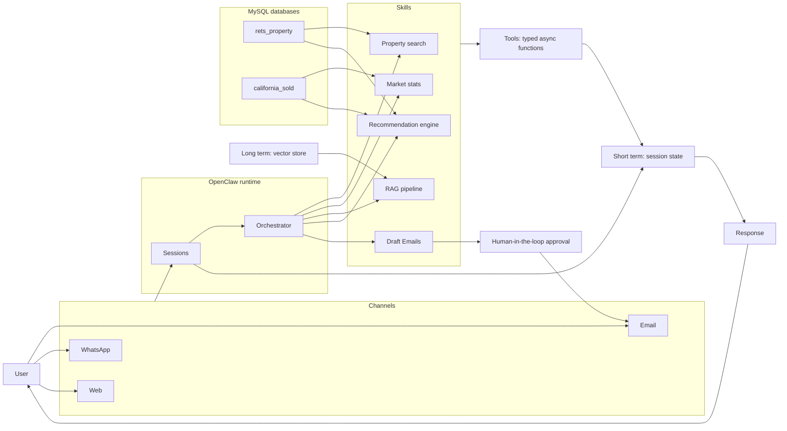

## Data access: two paths, one rule

Skills reach MySQL one of two ways. The rule is **what the work needs, not which
week it was written in**:

- **TypeScript talks to MySQL directly** (`skills/shared/db.ts`, `mysql2`) when the
  work is plain parameterized SQL — `propertySearch/search.ts`,
  `marketComps/comps.ts`.
- **Anything needing pandas, numpy, or embeddings goes through the FastAPI
  service** (`service.py`, on `127.0.0.1:8000`) — `marketComps/marketStats.ts`,
  `semanticSearch/semanticSearch.ts`, `recommendations/recommend.ts`. Those TS
  files are thin HTTP wrappers; the real work is in `market.py`, `semantic.py`,
  and `recommend.py`.

The split is deliberate. Embedding similarity and the hybrid recommendation
scorer need sentence-transformers and numpy, which have no equivalent in this
project's TS stack — so Python owns them and HTTP is how the skill layer reaches
them. Plain SQL gains nothing from that hop, and routing it through the service
would mean property search breaks whenever uvicorn is down.

Practical consequence: `search.ts` and `comps.ts` need only MySQL running.
`marketStats.ts`, `semanticSearch.ts`, and `recommend.ts` also need
`uvicorn service:app --reload`, and the last two need the embeddings file
(`listing_embeddings.npz`) already built.
