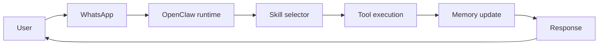

```mermaid
%% lifecycle — simple version of how query turns into response

flowchart LR
    U[User] --> WA[WhatsApp] --> RT[OpenClaw runtime] --> SK[Skill selector] --> TE[Tool execution] --> MEM[Memory update] --> R[Response] --> U
```
