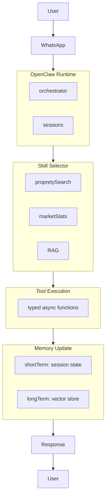

```mermaid
flowchart TD
    U_input[User]
    U_output[User]
    WA[WhatsApp]
    R[Response]

    subgraph OR[OpenClaw Runtime]
        O[orchestrator]
        S[sessions]
    end


    subgraph SS[Skill Selector]
        PS[propretySearch]
        MS[marketStats]
        RAG[RAG]
    end

    subgraph TE[Tool Execution]
        TAF[typed async functions]
    end

    subgraph MU[Memory Update]
        ST[shortTerm: session state]
        LT[longTerm: vector store]
    end


    U_input --> WA
    WA --> OR
    OR --> SS
    SS --> TE
    TE --> MU
    MU --> R
    R --> U_output


```
